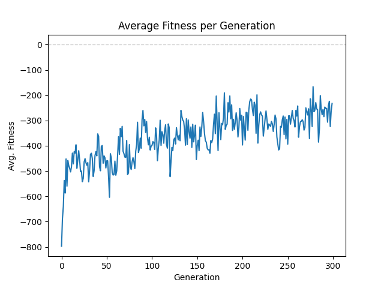
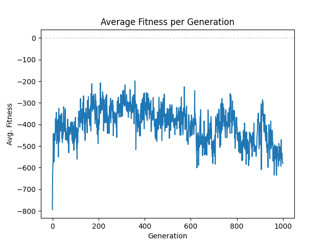
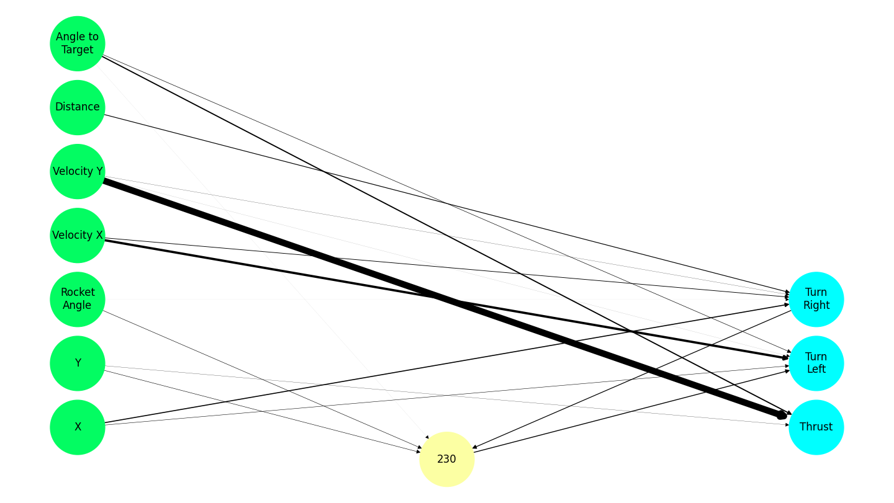

# NEAT Application for Rocket Landing Game

This README provides a detailed overview of the NEAT algorithm implementation used play the game. The goal here is to develop a neural network capable of controlling a rocket to land smoothly on a target, akin to SpaceX rockets. However, the best results achieved resembled missiles going directly to the target rather than the intended controlled landing.

### Overview

The NEAT (NeuroEvolution of Augmenting Topologies) algorithm was applied to evolve a neural network that controls the rocket’s landing behaviour. Many approaches _(and I mean way too many)_ were taken to refine the inputs, network architecture, and training process, leading to the identification of an optimal configuration. However, the results were not fully aligned with the intended outcome.

### Inputs

The neural network was trained using the following inputs:

1. `rocket.x`: Horizontal position of the rocket.
2. `rocket.y`: Altitude of the rocket from the ground.
3. `rocket.angle`: The angle of the rocket relative to the ground.
4. `rocket.velocity_x`: Horizontal velocity of the rocket
5. `rocket.velocity_y`: Vertical velocity of the rocket.
6. `rocket.distance`: The distance between the rocket and the target landing platform.
7. `rocket.angle_to_target`: The angle between the rocket _(relative to the ground)_ and the target platform.

#### Input Normalisation

To improve the performance of the NEAT algorithm, the inputs were normalised:

-   All inputs except angles were normalised to a range of 0 to 1.
-   Angles (`rocket.angle` and `rocket.angle_to_target`) were normalised to a range of -1 to 1.

### Outputs

The neural network in this NEAT implementation had three primary outputs, each corresponding to one of the rocket’s controls:

1. **Thrust:** Engaged the rocket’s booster to propel it upwards.
2. **Turn Left:** Rotated the rocket counterclockwise.
3. **Turn Right:** Rotated the rocket clockwise.

#### Output Activation and Network Behaviour

The neural network used a mix of activation functions, specifically Tanh and ReLU. This combination was allowed to mutate during training, enabling the network to adapt and optimise its activation responses based on performance. The general rule was that an output would only “fire” (i.e., engage the associated action) if the corresponding node’s output value was greater than 0.

#### Continuous vs. Discrete Output Handling

Initially, the outputs were handled continuously. This meant that during each frame, if the **Thrust** output was greater than 0, the rocket’s booster would engage. Simultaneously, the turn mechanism would activate for whichever of **Turn Left** or **Turn Right** had a higher output, assuming either was greater than 0. However, this approach led to highly erratic and unpredictable motion, with the rocket frequently making random, ineffective adjustments.

To address this issue, the approach was changed to a discrete output handling method. Instead of potentially engaging multiple controls each frame, the network would now select only the maximum output value among the three. If this maximum value was greater than 0, the corresponding action (thrust, turn left, or turn right) would be executed, and the other outputs would be ignored. This change led to more predictable and stable rocket behaviour, significantly improving the training process. The predictability in motion likely contributed to the network’s ability to learn more effective strategies for landing the rocket.

### Fitness Function

In the NEAT implementation for the game, the fitness function played a central role in guiding the evolution of the neural network. The following criteria were used to evaluate and reward the performance of each rocket:

**1. Staying Alive**

-   In some iterations of training, rockets were rewarded with a constant fitness boost for simply staying alive during the simulation (`STAYING_ALIVE_CONST`). This encouraged survival as a basic metric of success, however, it unintentionally encouraged rockets to hover in place rather than moving. In some earlier iterations, this reward was used as a punishment (akin to wasting fuel) by setting it to a negative value. However, for the best-performing iteration, this reward was set to 0, eliminating its influence on the training process.

**2. Nearing the Target**

-   Rockets were awarded additional fitness when they moved closer to the target (`NEARING_TARGET_BONUS`). The closer the rocket got to the landing platform, the more points it earned. This helped in training the rockets to focus on the target.

**3. Distance from the Target**

-   A substantial fitness reward was given if a rocket landed within 100 pixels of the target. This reward was further increased based on the rocket’s proximity to the centre of the target, using the formula `(WIN_WIDTH - rocket.distance) * DISTANCE_CONST`.

**4. Rocket’s Angle**

-   Upon landing, the rocket’s angle was also considered, with rewards given for maintaining a near-vertical orientation (90 degrees). The fitness was calculated using `(90 - abs(rocket.angle)) * ANGLE_CONST`, incentivising rockets to maintain a correct landing posture.

**5. Penalties**

-   **Out of Screen:** Rockets that flew out of the screen were penalised (`OUT_OF_SCREEN_PENALTY`), as this behaviour was undesirable.
-   **Remaining Still:** Rockets that did not change their `x` position were penalised for remaining stationary (`REMAIN_STILL_PENALTY`). This penalty discouraged rockets from idling.
-   **Wasting Time:** If a rocket did not complete the landing within the specified time limit, it was penalised for wasting time (`TIME_WASTING_PENALTY`). This ensured that the rockets were not only accurate but also efficient in reaching the target.

While the combination of rewards and penalties did guide the evolution process, it also introduced a degree of randomness and unpredictability. In many iterations, the rockets failed to generalise and learn to consistently reach the target. This behavior was likely not solely due to the fitness function but rather a limitation of the NEAT algorithm or the chosen network architectures.

    Special Note: There was an attempt to penalise rockets for landing with a high velocity, but this was later removed as it was found to be counterproductive to the training process and limited rockets from generalising well. The code for this penalty is still present in the implementation but is commented out.

### Network Architecture

Several network architectures were explored to achieve the best results:

-   **Hidden Layers:** The best results were obtained using one hidden layer. Training typically started with 5 nodes, but the algorithm frequently eliminated nodes, resulting in a final architecture with fewer nodes in the hidden layer.
-   **Additional/No Hidden Layers:** Any attempt to increase the number of hidden layers or remove the hidden layer altogether resulted in suboptimal performance. Rockets in these configurations tended to make continuous circular motions, eventually crashing because this behaviour yielded the best average result for the species in the large population.

#### Performance Over Generations

-   **Best Performance:** The best network configuration produced rockets that homed in on the target like missiles. This behaviour, though unintended, was the most successful, with the optimal results observed by generation 300.
-   **Performance Decline:** After generation 300, the fitness performance of the rockets started to decline significantly by generation 1000. This decline might be attributed to overfitting or the evolutionary algorithm getting trapped in a local optimum, where the diversity of solutions decreased, leading to poorer overall performance.

### Graphs and Network Diagram

To better understand the performance of the NEAT algorithm over time, the following visualisations are included:

1. **Performance Graphs:**
- Performance Up to Generation 300

- Performance Up to Generation 1000

3. **Final Neural Network Diagram:**

These visualisations provide insights into the training process, highlighting the peak performance period and the eventual decline in fitness.

### Conclusion

This NEAT implementation for the rocket landing game showcases the complexities of evolving a neural network to control a dynamic system. While the desired SpaceX-style landing was not achieved, the process yielded valuable insights into network architecture and evolutionary dynamics. The results highlight the importance of balancing network complexity and maintaining solution diversity to avoid stagnation in long-term training.
